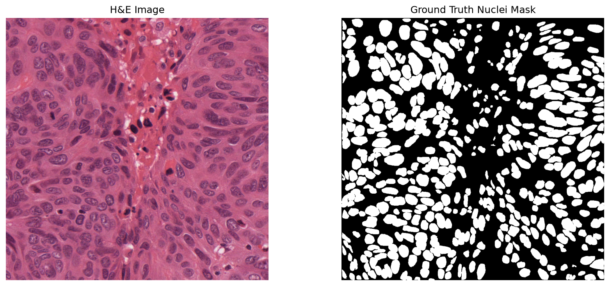
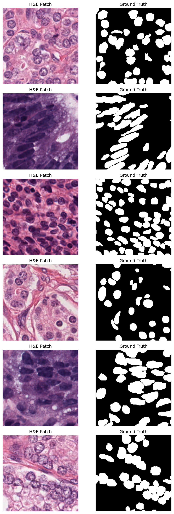
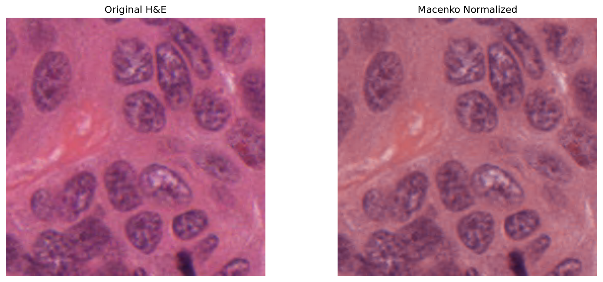
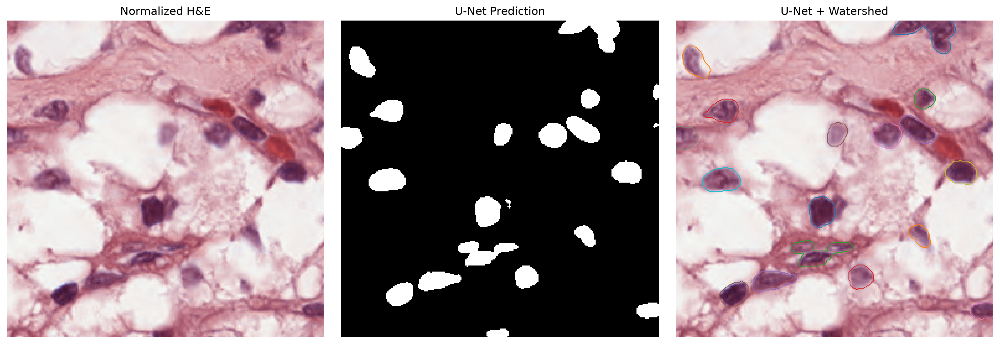
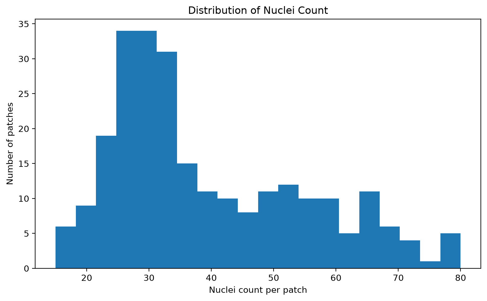
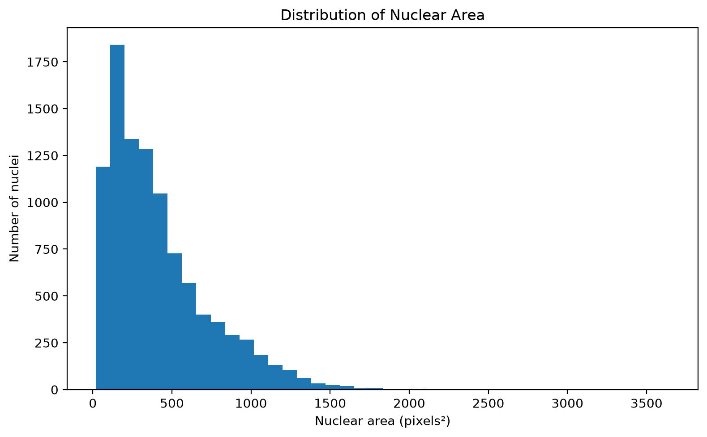
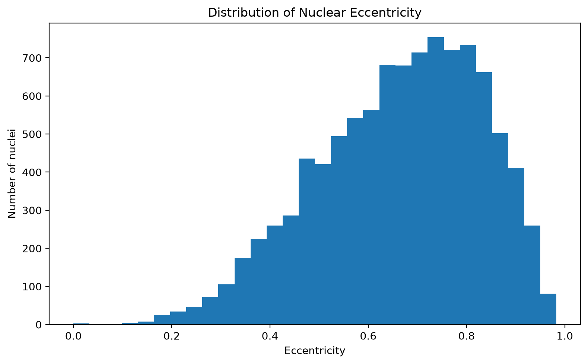
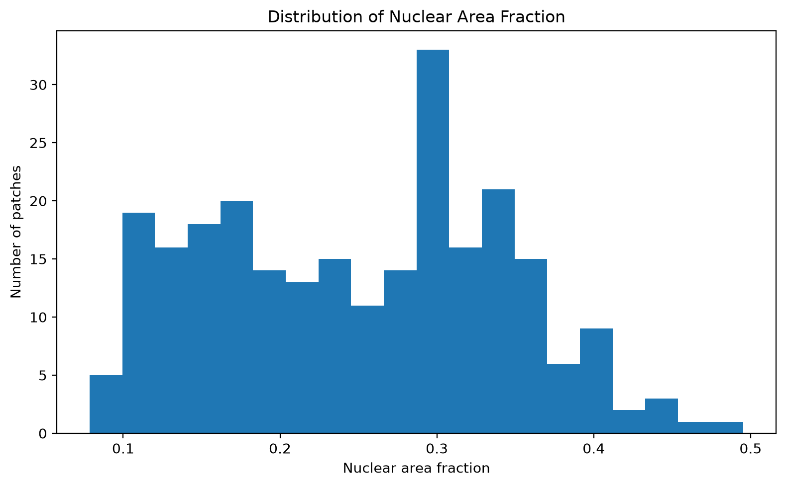

# Histopathology Nuclei Segmentation

An end-to-end deep learning pipeline for nuclei segmentation and quantification in H&E-stained histopathology images using U-Net.

## Overview

Nuclei segmentation is an important step in computational pathology because it enables automated analysis of nuclear morphology and distribution.

This project implements a patch-based nuclei segmentation pipeline using the MoNuSeg dataset. The workflow includes XML annotation conversion, dataset splitting, patch extraction, H&E stain normalization, data augmentation, U-Net segmentation, model evaluation, watershed-based nuclei separation, and nuclei quantification.

## Pipeline

```text
MoNuSeg H&E Images
        ↓
XML Annotations → Binary Masks
        ↓
Image-level Train / Validation Split
        ↓
256 × 256 Patch Extraction
        ↓
Macenko Stain Normalization
        ↓
Data Augmentation
        ↓
U-Net Training
        ↓
Segmentation Evaluation
        ↓
U-Net Predictions
        ↓
Watershed-based Nuclei Separation
        ↓
Nuclei Quantification & Statistics
```

## Dataset

This project uses the **MoNuSeg 2018 Training Dataset**, a dataset developed for nuclei segmentation in multi-organ histopathology images.

The dataset contains:

- H&E-stained histopathology tissue images
- Manually annotated nuclear boundaries
- Images acquired at approximately **40× magnification**
- XML annotation files containing polygon coordinates for individual nuclei
- Multiple tissue types and organs

The XML annotations were converted into binary segmentation masks before model training.

### Dataset Source

Official MoNuSeg dataset page:

https://monuseg.grand-challenge.org/Data/

The dataset is **not included in this repository**.

### Dataset Preparation

The downloaded training data contained:

- **37 annotated tissue images**
- Corresponding XML annotation files
- Corresponding H&E tissue images

The dataset was split at the **original image level** into training and validation sets before patch extraction to avoid having patches from the same original image appear in both sets.

The resulting split was:

- **30 training images**
- **7 validation images**

### Patch Extraction

The images were divided into overlapping patches using:

- Patch size: **256 × 256 pixels**
- Stride: **128 pixels**

Patches were filtered to retain regions containing sufficient tissue or nuclear content.

The resulting dataset contained:

- **1,080 training patches**
- **252 validation patches**
- **1,332 total patches**

## Preprocessing

### XML Annotation to Binary Mask

Each nucleus annotation is represented as a polygon in the XML files.

The polygon coordinates were converted into binary masks:

```text
Background → 0
Nucleus    → 255
```

### Train / Validation Split

The split was performed at the **image level**, before patch extraction.

This prevents patches originating from the same original tissue image from appearing in both training and validation sets.

### Macenko Stain Normalization

Histopathology images can show variation in staining intensity and color.

**Macenko stain normalization** was applied to reduce this variation and provide more consistent H&E appearance across image patches.

The normalization was applied to the image patches while keeping the corresponding segmentation masks unchanged.

### Data Augmentation

Training patches were augmented using **Albumentations** to improve model generalization and robustness to image variation.

## Model

A **U-Net** architecture was implemented using PyTorch for binary nuclei segmentation.

The model performs pixel-wise segmentation:

```text
Input H&E Patch
       ↓
     U-Net
       ↓
Binary Segmentation Mask
       ↓
Background / Nuclei
```

A combined **Binary Cross-Entropy + Dice Loss** was used during training.

## Training

The model was trained using the normalized training patches and evaluated on the validation patches.

Training was performed using an NVIDIA GPU.

The best-performing model checkpoint was saved for subsequent evaluation and prediction.

## Evaluation

The segmentation model was evaluated using:

- Dice Score
- Intersection over Union (IoU)
- Precision
- Recall
- F1 Score
- Pixel Accuracy

The model achieved a validation Dice score of approximately **0.82** on the validation patches.

## Nuclei Quantification

The predicted binary segmentation masks were further processed using **watershed-based separation** to separate touching nuclei.

The following measurements were extracted:

- Nuclei count
- Nuclear area
- Eccentricity
- Nuclear area fraction

For the validation patches, the watershed-based post-processing detected approximately:

- **9,903 nuclei**
- **39.3 nuclei per patch on average**
- **416.5 pixels² mean nuclear area**
- **334 pixels² median nuclear area**
- **0.25 mean nuclear area fraction**

> Note: Watershed-based nuclei counts are post-processing estimates and are not equivalent to instance-level segmentation accuracy.

## Results

### Dataset and Ground-Truth Mask



### Extracted Patches



### Macenko Stain Normalization



### U-Net Predictions

Example prediction visualizations showing the original image, ground-truth mask, predicted segmentation, and overlay are available in:

`outputs/figures/predictions/`

### Watershed Post-processing



### Nuclei Statistics

The project generates distributions for nuclei count, nuclear area, eccentricity, and nuclear area fraction.

#### Nuclei Count



#### Nuclear Area



#### Eccentricity



#### Nuclear Area Fraction



## Project Structure

```text
histopathology-nuclei-segmentation/
│
├── src/
│   ├── augmentation.py
│   ├── dataset.py
│   ├── evaluate.py
│   ├── extract_patches.py
│   ├── loss.py
│   ├── normalize_dataset.py
│   ├── nuclei_statistics.py
│   ├── prepare_masks.py
│   ├── quantify_nuclei.py
│   ├── split_dataset.py
│   ├── stain_normalization.py
│   ├── train.py
│   ├── unet.py
│   ├── visualize_dataset.py
│   ├── visualize_patches.py
│   ├── visualize_predictions.py
│   ├── visualize_prediction_watershed.py
│   ├── visualize_watershed.py
│   └── watershed_nuclei.py
│
├── outputs/
│   ├── figures/
│   │   ├── predictions/
│   │   └── statistics/
│   └── quantification/
│       └── watershed_predictions/
│
├── requirements.txt
├── .gitignore
└── README.md
```

## Installation

Clone the repository:

```bash
git clone https://github.com/Harshitha724/histopathology-nuclei-segmentation.git
cd histopathology-nuclei-segmentation
```

Create a virtual environment:

```bash
python3 -m venv .venv
source .venv/bin/activate
```

Install the required packages:

```bash
pip install -r requirements.txt
```

Download the MoNuSeg dataset from the official source and place it under:

```text
data/raw/
```

## Running the Pipeline

The main scripts can be executed in the following order:

```bash
python3 src/prepare_masks.py
python3 src/split_dataset.py
python3 src/extract_patches.py
python3 src/normalize_dataset.py
python3 src/train.py
python3 src/evaluate.py
python3 src/visualize_predictions.py
python3 src/watershed_nuclei.py
python3 src/nuclei_statistics.py
```

## Technologies

- Python
- PyTorch
- U-Net
- Albumentations
- TorchStain
- NumPy
- OpenCV
- scikit-image
- SciPy
- Pandas
- Matplotlib
- Pillow

## Future Work

Possible extensions include:

- Whole-slide image (WSI) processing
- OpenSlide-based `.svs` image handling
- Automated tissue-region detection
- Large-scale WSI tiling
- Whole-slide segmentation reconstruction
- Instance-level segmentation evaluation

## License

This project is intended for educational and research purposes.
